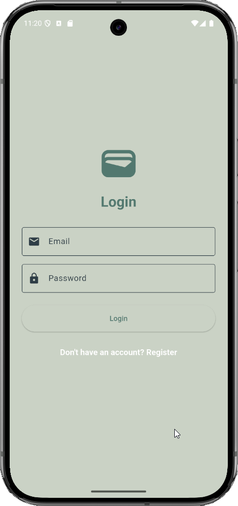
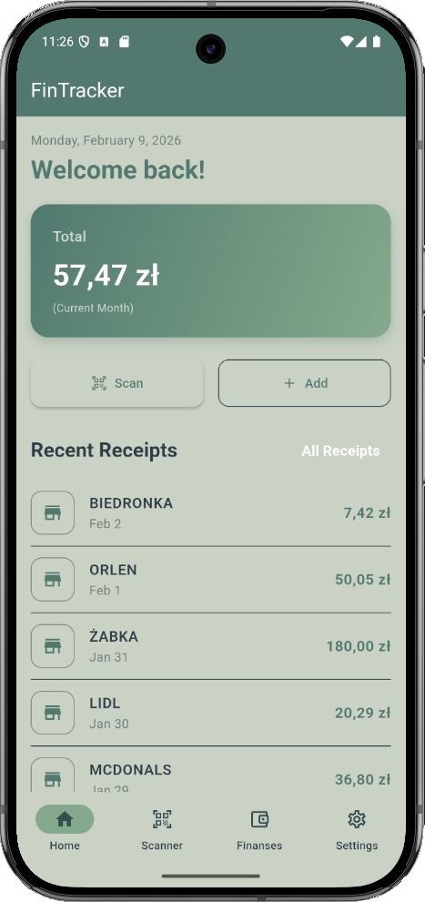
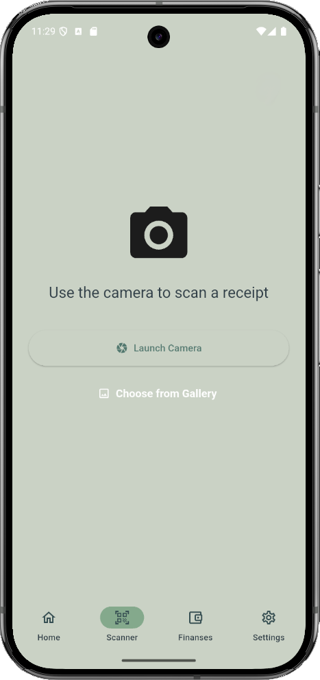
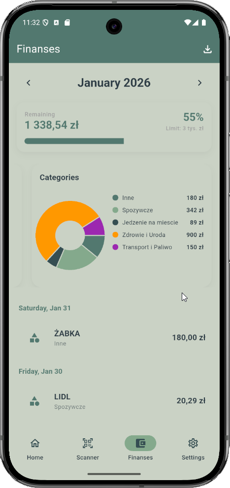
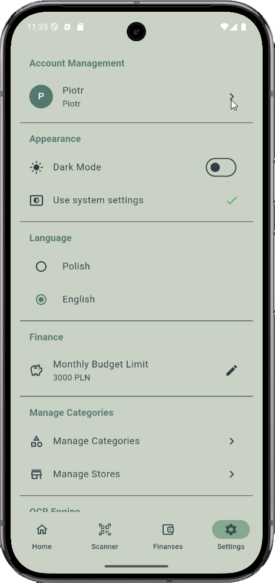

# FinTracker

**FinTracker** to kompleksowa aplikacja mobilna do zarządzania finansami osobistymi, umożliwiająca śledzenie wydatków, skanowanie paragonów z wykorzystaniem OCR (Optical Character Recognition) oraz analizę budżetu za pomocą wykresów.

System składa się z backendu opartego na **.NET 8** oraz aplikacji mobilnej stworzonej we frameworku **Flutter**.

---

## 📸 Wizualizacja

| Ekran Logowania | Ekran Główny | Skaner Paragonów | Wydatki | Ustawienia |
|:---:|:---:|:---:|:---:|:---:|
|  |  |  |  |  |

---

## 🛠 Technologie i Komponenty

### Backend (API)
* **Framework:** .NET 8.0 (Web API)
* **Baza danych:** Azure SQL Database (Entity Framework Core)
* **Uwierzytelnianie:** JWT (JSON Web Tokens)
* **OCR & AI:**
    * **Tesseract OCR** (lokalne przetwarzanie obrazu)
    * **Azure Computer Vision** (chmurowe przetwarzanie)
    * **Google Gemini AI** (analiza treści paragonów)
* **Dokumentacja API:** Swagger (Swashbuckle)
* **Testy:** xUnit, Moq

### Frontend (Mobile App)
* **Framework:** Flutter (Dart 3.6.1+)
* **Zarządzanie stanem:** Provider
* **Komunikacja z API:** Dio (z obsługą Refresh Token i Retry Policy)
* **Wykresy:** FL Chart
* **Lokalne przechowywanie:** Shared Preferences, Flutter Secure Storage
* **Skanowanie:** Google ML Kit Text Recognition, Camera, Image Picker

---

## ⚙️ Wymagania Środowiskowe

Aby uruchomić projekt lokalnie, upewnij się, że masz zainstalowane:

1.  **Dla Backend:**
    * [.NET SDK 8.0](https://dotnet.microsoft.com/download/dotnet/8.0)
    * Dostęp do **Azure SQL Database** (Connection String)
    * Klucze API do usług Azure (Computer Vision) oraz Google Gemini (opcjonalnie dla OCR)
    * Visual Studio 2022 lub VS Code
2.  **Dla Mobile App:**
    * [Flutter SDK](https://flutter.dev/docs/get-started/install)
    * Android Studio
    * Urządzenie z Androidem (min. SDK 21) lub iOS

---

## 🚀 Instalacja i Uruchomienie (Krok po Kroku)

### 1. Konfiguracja Backendu (FinTracker.API)

1.  **Sklonuj repozytorium:**
    ```bash
    git clone [https://github.com/twoj-user/fintracker.git](https://github.com/twoj-user/fintracker.git)
    cd fintracker/FinTracker.API
    ```

2.  **Skonfiguruj `appsettings.json`:**
    Otwórz plik `appsettings.json` i uzupełnij brakujące klucze. Jeśli używasz User Secrets, dodaj je tam.
    ```json
    {
      "ConnectionStrings": {
        "DefaultConnection": "Server=(localdb)\\mssqllocaldb;Database=FinTrackerDb;Trusted_Connection=True;"
      },
      "AzureComputerVision": {
        "Endpoint": "TWOJ_AZURE_ENDPOINT",
        "Key": "TWOJ_AZURE_KEY"
      },
      "Gemini": {
        "ApiKey": "TWOJ_GEMINI_API_KEY"
      },
      "Jwt": {
        "Key": "TWOJ_BARDZO_DŁUGI_SEKRETNY_KLUCZ_MIN_32_ZNAKI",
        "Issuer": "FinTracker",
        "Audience": "FinTrackerUsers"
      }
    }
    ```

3.  **Zastosuj migracje bazy danych:**
    W terminalu w katalogu `FinTracker.API` wykonaj:
    ```bash
    dotnet tool install --global dotnet-ef
    dotnet ef database update
    ```

4.  **Uruchom API:**
    ```bash
    dotnet run
    ```
    API powinno być dostępne pod adresem `https://localhost:7081` (lub podobnym). Swagger dostępny pod `/swagger`.

---

### 2. Konfiguracja Aplikacji Mobilnej (fintracker)

1.  **Przejdź do katalogu aplikacji:**
    ```bash
    cd ../fintracker
    ```

2.  **Pobierz zależności:**
    ```bash
    flutter pub get
    ```

3.  **Konfiguracja adresu API:**
    *Domyślnie aplikacja łączy się z chmurowym API na Azure.*
    Aby testować lokalnie, otwórz plik `lib/data/services/api_client.dart` i zmień `baseUrl`:
    ```dart
    // Dla emulatora Androida (localhost komputera to 10.0.2.2)
    static const String baseUrl = '[http://10.0.2.2:5000](http://10.0.2.2:5000)'; 
    // Lub Twój lokalny adres IP dla fizycznego urządzenia
    ```

4.  **Uruchom aplikację:**
    Podłącz telefon lub uruchom emulator, a następnie wpisz:
    ```bash
    flutter run
    ```

---

## 📘 Dokumentacja Techniczna

### Architektura Systemu

#### Backend (Clean Architecture / N-Tier)
Projekt API jest podzielony na warstwy, aby zapewnić separację odpowiedzialności:
* **FinTracker.API:** Kontrolery, Middleware (obsługa wyjątków), konfiguracja DI.
* **FinTracker.Services:** Logika biznesowa, parsowanie paragonów, serwisy OCR (Factory Pattern dla wyboru silnika OCR).
* **FinTracker.DataAccess:** Kontekst bazy danych (EF Core), Migracje, Repozytoria.
* **FinTracker.Models:** Encje bazy danych, DTOs (Data Transfer Objects), Enumy.

#### Frontend (MVVM - Model-View-ViewModel)
Aplikacja Flutter korzysta ze wzorca MVVM, gdzie:
* **View (UI):** Warstwa prezentacji (`lib/ui/view`), widgety.
* **ViewModel:** Zarządzanie stanem widoków (`lib/ui/view_models`), korzysta z `ChangeNotifier`.
* **Model/Data:** Serwisy (`lib/data/services`) odpowiedzialne za komunikację z API i logikę danych.

### Kluczowe funkcjonalności techniczne

1.  **Mechanizm Refresh Token:**
    Klasa `ApiClient` posiada `AuthInterceptor`, który automatycznie wykrywa błąd 401. Jeśli token wygaśnie, aplikacja w tle wysyła żądanie odświeżenia tokena (`/refresh-token`), zapisuje nowy token w `SecureStorage` i ponawia oryginalne zapytanie bez wylogowywania użytkownika.

2.  **Wieloskładnikowy OCR:**
    System wspiera różne silniki OCR. W zależności od konfiguracji lub dostępności, aplikacja może użyć:
    * Google ML Kit (na urządzeniu - offline/szybki).
    * Tesseract (na backendzie).
    * Azure Vision / Gemini (chmura - wysoka dokładność).

3.  **Lokalizacja (i18n):**
    Aplikacja wspiera wielojęzyczność (PL/EN) przy użyciu `flutter_localizations` i plików `.arb`.

---
